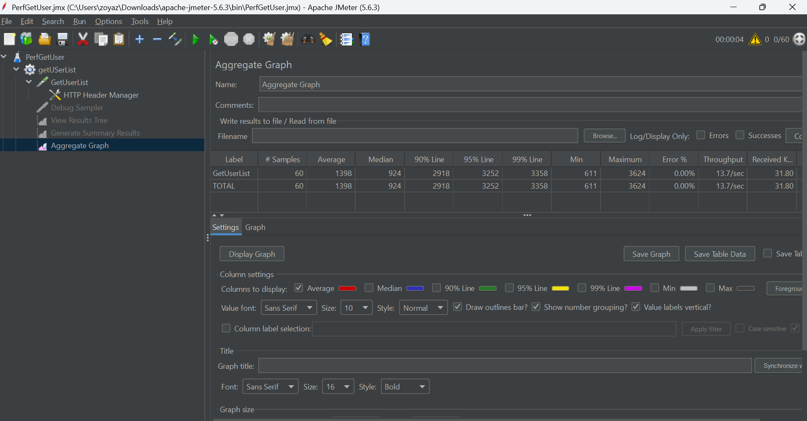

#Performance Test Approach for getUser API Endpoint

## 1. Playwright

### In playwright.config.js add the number of projects and execute test using respective workers 
#### For example for concurrent users scenario each worker is considered a user so 5 workers represent 5 Users
###### npx playwright test tests/getAllUserList.spec.js --workers=5
[Sample-1](./PerfGetUserList5Users.png)

###### npx playwright test tests/getAllUserList.spec.js --workers=30
[Sample-2](./30WorkersGetUSerDetails.png)

###### npx playwright test tests/getAllUserList.spec.js --workers=60
[Sample-3](./60usersResults.png)

## 2. Using Jmeter
###### 1. create User Thread Group with threads ranging from 5,15,30,60
###### 2. Run the ThreadGroup for http request Get User with headers
###### 3. Capture Results
#### Aggregate Sample Results
