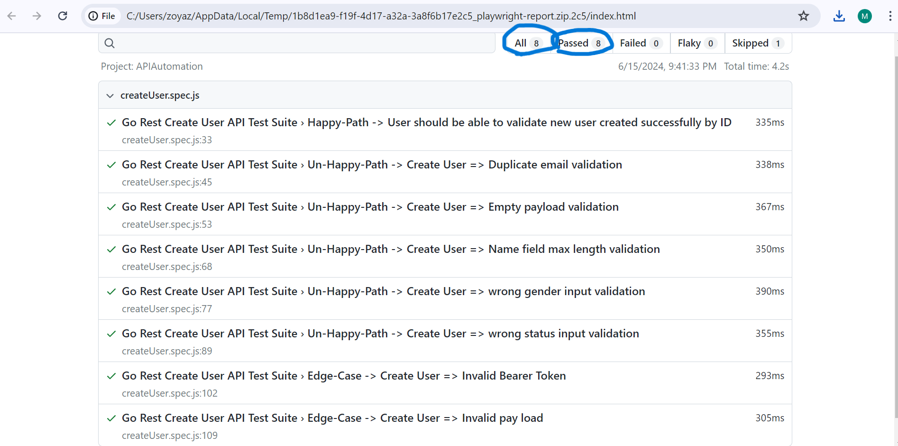
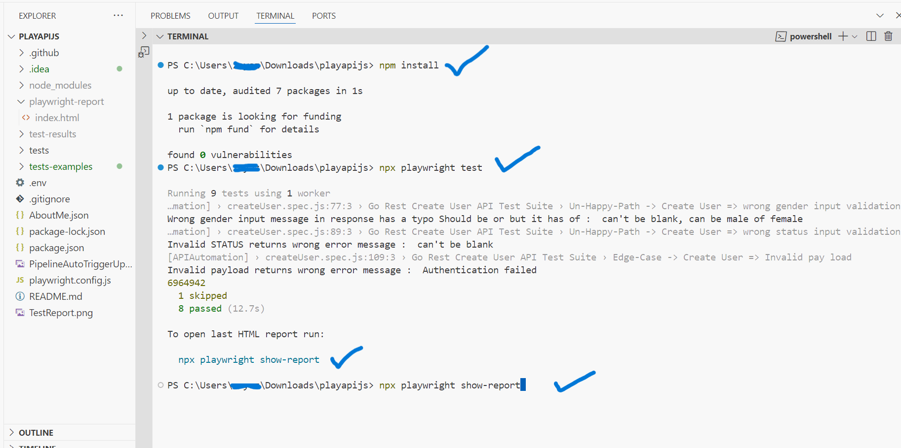

# PLAYAPIJS => API Automation Solution

### This is a Sample Project to test APIs using JavaScript and Playwright. In this project you will find all the configurations & Test cases required to test the endpoints by Go Rest (https://gorest.co.in/)
#### Why GO Rest???  Unlike the other API's mentioned GOREST provides below endpoints for free without need to signup or add card!!
###### POST => /public/v2/users	=> Create a new user
###### GET => /public/v2/users/6940081	=> Get user details By ID
###### PUT|PATCH => /public/v2/users/6940081 => Update user details by ID
###### DELETE => /public/v2/users/6940081	=> Delete user By ID

#### Test Scenarios Covered => I Considered CREATE, GET and DELETE Endpoints for this Challenge
##### Happy Path cases:
- To successfully test CREATE USER post API endpoint with valid inputs
##### UnHappy / Negative cases:
- To test CREATE USER post API endpoint with invalid inputs
##### Edge Cases:
- To test for any other error cases

#### PreRequisites
1. nodejs
2. Any IDE of your choice [I used VSCode]

#### Setup
1. Clone Repository from github using command below
    - HTTPS: git clone https://github.com/msbegumshaik/playapijs.git
    - SSH : git clone git@github.com:msbegumshaik/playapijs.git
    - OR simply download as zip, unzip and go ahead
2. Open cloned Repository from vscode/Any IDE
3. open Terminal
4. In Project root directory  example: C:\Users\username\AnyFolder\playapijs>
5. Install All Dependencies using command >>> npm install >>> All dependencies must be installed here successfully

#### Test Execution Steps
##### In Your Local => In Project root directory  example: C:\Users\username\AnyFolder\playapijs>
#### 1. execute tests using  => npx playwright test
#### 2. execute tests using specific spec file => npx playwright test tests/createUser.spec.js

#### Test Report
1. Verify HTML Test Execution Report using 
    ###### npx playwright show-report 
    OR
    ###### open index.html generated under ./playwright-report folder

### CI/CD Integration using GITHUB Actions
##### For Every push to this Repository a pipeline is auto triggered and tests will be executed and report is saved as artifact
#### CI/CD [GITHUB PIPELINE LINK](https://github.com/msbegumshaik/playapijs/actions/runs/9529825297). 

#### WORKING SNEAK PEAK OF TEST SETUP & TEST EXECUTION & TEST REPORT

### Docker
##### The Solution is containerized using dokcer and can be run simply using below Commands
###### docker build -t playapijs:1.1 .

###### docker run -i -t playapijs:1.1

